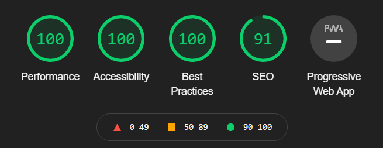

# Recipe WebApp

## Objectives:

- Make a recipe fetcher app utilising API and async/await
- Utilise one further API
- Validate user input

## Process:
### JS 
After creeating the intial logic used to fetch the recipes using an sync function, I then decided to format them using another function to inject each one onto the webpage as part of an ordered list. They would be appended to an empty div element. The list would be scrollable, as I think carousels are generally frowned upon.    
I then decided to make it an "infinte" scrolling experience, so the page would load more content once it detected that the user had either scrolled to the bottom of the page, or the bottom of the page was already displayed (i.e. there is no scrollable area). This was tricky and required a lot of research into the positioning of elements on the page. I initially wanted to start the loading process when the user had scrolled to the last few elements, by looking at when the third or fifth from last recipe (via the URI class added to the li element) was in the visible portion of the screen, to make it mores eamless (loading in the background), but quickly realised that change in object postion has browser-specific implementations i.e. wether delta change in position is reported or absolute, and I didn't want to clutter my code with browser specific implementations, so used the loss of scrollbar/or last element to decide to load more.  
The rest of the JS was uneventful, I decided to just ignore empty inputs, and any non-valid input would just return no search results anyway, so I did not think the input box required more validation than that.  
I initially wanted to use an image classifier API to make an image search - it would detect the ingredients in the picture or the overally most likely food, and use that to generate search queries for recipies, but didn't have enough google cloud credits left, and coudln't find a free implementation. I then thought about using a quote API to use the search query to pull up a meaningful quote about that search query, but couldn't find any free quote API's that allowed searching using tags and that had a decent amount of quotes, so settled for a random quote.  
### CSS  
I initially tried using media queries to develop for both mobile and desktop, but was less than impressed at the duplicate code which seemed uneccesary to me. I then decided to purely use CSS grid, and utlised subgrids (many of them due to my inexperience with grid). It was a valuable learning experience and I am more confident about CSS now. I am not entirely satisfied with the outcome on the whole, and there are many things I would change about the design if I had more time, but for now, it works.

### Current Site  

  

### Areas to Improve:  
1. I failed to implement an expanding recipe card - Ideally the user would click on the recipe or picture, and the recipe would expand, showing the nutritional information, and a tag-cloud of all the health labels associated with it, and then click again to be taken to the recipe. I couldn't get the items next to it to move along one column, even trying using column-span, and the alignemnt would shift elsewhere so I reverted back to the simple link to the recipe, and I don;t yet know how to change the orientation of the expansion depending on the screen width using purely css grid/flex rather than media queries.
2. Consider loading smaller images first to improve loading times/reduce bandwidth used
3. Add a random recipe button
4. Add a search by cuisine or food type
5. Utilise an NLP API to determine the search tags for advanced searching rather than using an object which I had to hard-code the additional search terms into
